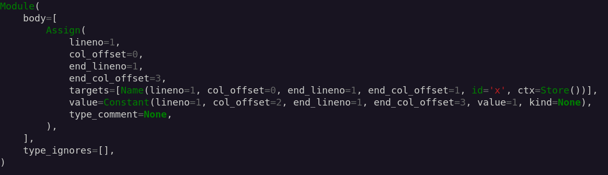

# astprettier

[](https://pypi.org/project/astprettier)
[](https://github.com/ronny-rentner/astprettier/actions/workflows/ci.yml)
[](https://www.python.org/downloads/)
[](https://github.com/ronny-rentner/astprettier/blob/master/license.txt)

Pretty print Python AST nodes, the return value of `ast.parse`

__Note:__ This is a fork of [astpretty](https://github.com/asottile/astpretty). The goals of this fork are:
 * Adding more advanced features that go beyond the REPL scope of astpretty
 * Refactoring and cleanup to make the very small code base easier to understand and maintain
 * Experimentation with Python packaging to make the project directory more beautiful and have less boilerplate

## Installation

`pip install astprettier`

## Usage

### REPL

`astprettier` provides two main functions:

`astprettier.format(node, indent_level=0, indent='    ', show_offsets=True, ns_prefix='')`
`astprettier.print(node, indent_level=0, indent='    ', show_offsets=True, ns_prefix='')`

`astprettier.print` is a thin wrapper around `astprettier.format` that just writes the output of `format` to `sys.stdout`

```python
>>> import ast, astprettier
>>> astprettier.print(ast.parse('if x == y: y += 4').body[0])
If(
    lineno=1,
    col_offset=0,
    test=Compare(
        lineno=1,
        col_offset=3,
        left=Name(lineno=1, col_offset=3, id='x', ctx=Load()),
        ops=[Eq()],
        comparators=[Name(lineno=1, col_offset=8, id='y', ctx=Load())],
    ),
    body=[
        AugAssign(
            lineno=1,
            col_offset=11,
            target=Name(lineno=1, col_offset=11, id='y', ctx=Store()),
            op=Add(),
            value=Num(lineno=1, col_offset=16, n=4),
        ),
    ],
    orelse=[],
)

>>> # Comparison with ast.dump()
>>> ast.dump(ast.parse('if x == y: y += 4').body[0])
"If(test=Compare(left=Name(id='x', ctx=Load()), ops=[Eq()], comparators=[Name(id='y', ctx=Load())]), body=[AugAssign(target=Name(id='y', ctx=Store()), op=Add(), value=Constant(value=4))], orelse=[])"
```

`ns_prefix` controls whether objects from the ast module will be prefixed with your ast namespace:

```python
>>> astprettier.print(ast.parse('x += 5').body[0], show_offsets=False, ns_prefix='ast')
ast.AugAssign(
    target=ast.Name(id='x', ctx=ast.Store()),
    op=ast.Add(),
    value=ast.Num(n=5),
)
```

### Console

On console, you can either pass Python syntax via STDIN or provide a filename.

```bash
$ astprettier -h
usage: astprettier.py [-h] [--show-offsets] [-n] [-i INDENT] [-l INDENT_LEVEL] [-p NS_PREFIX] [-c] filename

positional arguments:
  filename

optional arguments:
  -h, --help            show this help message and exit
  --show-offsets
  -n, --no-show-offsets
  -i INDENT, --indent INDENT
  -l INDENT_LEVEL, --level INDENT_LEVEL
  -p NS_PREFIX, --ns-prefix NS_PREFIX
  -c, --colorize
```

`astprettier` can optionally colorize the console output with pygments.

```bash
$ echo 'x=1' | astprettier -c
```


## Contributing

We love contributions!

astprettier is open source, built on open source, and we'd love to have you hang out in our community.

